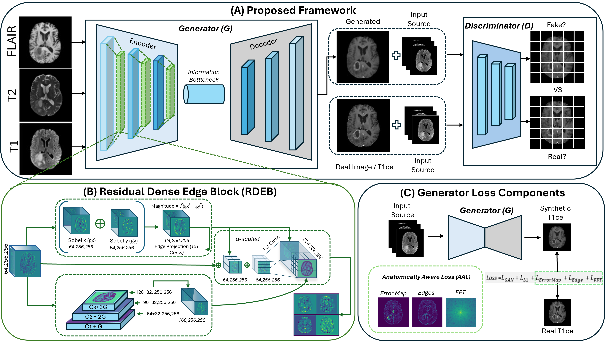

# AA-ViT
Official PyTorch Implementation of **AA-ViT (Anatomically Aware Vision Transformer)**, a model for contrast-enhanced brain MRI synthesis built on top of the **ResViT** baseline. AA-ViT is described in our MIUA 2026 (METIS Workshop) paper:

O. T. Meraj, T. Flannery, C. Cummins, M. Townend, T. C. Booth, P. Crossley, M. McCann, I. Overton and S. Unnikrishnan, "AA-ViT: Anatomically Aware Vision Transformer with Structural and Frequency Guidance for Contrast Enhanced Brain MRI Synthesis," accepted at MIUA 2026, METIS Workshop. Preprint: [arXiv:2607.07553](https://arxiv.org/abs/2607.07553).

> This is a preprint citation — it will be updated to the camera-ready conference proceedings once published.



*Overview of the proposed AA-ViT framework. (A) Generator–discriminator architecture for synthesizing contrast-enhanced MRI (CEMRI) from pre-contrast MRI inputs. (B) Residual Dense Edge Block (RDEB) for gradient-based edge feature representation. (C) Multi-component anatomically aware training objective.*

## Dependencies

```
python>=3.6.9
torch>=1.7.1
torchvision>=0.8.2
visdom
dominate
scikit-image
h5py
scipy
ml_collections
cuda=>11.2
```
## Installation
- Clone this repo:
```bash
git clone https://github.com/TalhaMeraj/resvit
cd resvit
```

## Download pre-trained ViT models from Google
* [Pre-trained ViT models](https://console.cloud.google.com/storage/vit_models/):
```bash
wget https://storage.googleapis.com/vit_models/imagenet21k/R50+ViT-B_16.npz &&
mkdir ../model/vit_checkpoint/imagenet21k &&
mv {MODEL_NAME}.npz ../model/vit_checkpoint/imagenet21k/R50-ViT-B_16.npz
```

## Dataset
To reproduce the results reported in the paper, we recommend the following dataset processing steps:

Sequentially select subjects from the dataset.
Apply skull-stripping to 3D volumes.
Select 2D cross-sections from each subject.
Normalize the selected 2D cross-sections before training and before metric calculation.
You should structure your aligned dataset in the following way:
```
/Datasets/BRATS/
  ├── T1_T2
  ├── T2_FLAIR
  .
  .
  ├── T1_FLAIR_T2   
```
```
/Datasets/BRATS/T2__FLAIR/
  ├── train
  ├── val  
  ├── test   
```
Note that for many-to-one tasks, source modalities should be in the Red and Green channels. (For 2 input modalities)

## Pre-training of ART blocks without the presence of transformers
It is recommended to pretrain the convolutional parts of the ResViT model before inserting transformer modules and fine-tuning. This signifcantly improves ResViT's.

For many-to-one tasks: 

<br />

```
python3 train.py --dataroot Datasets/IXI/T1_T2__PD/ --name T1_T2_PD_IXI_pre_trained --gpu_ids 0 --model resvit_many --which_model_netG res_cnn 
--which_direction AtoB --lambda_A 100 --dataset_mode aligned --norm batch --pool_size 0 --output_nc 1 --input_nc 3 --loadSize 256 --fineSize 256 
--niter 50 --niter_decay 50 --save_epoch_freq 5 --checkpoints_dir checkpoints/ --display_id 0 --lr 0.0002
```

<br />
<br />
For one-to-one tasks: <br />

```
python3 train.py --dataroot Datasets/IXI/T1_T2/ --name T1_T2_IXI_pre_trained --gpu_ids 0 --model resvit_one --which_model_netG res_cnn 
--which_direction AtoB --lambda_A 100 --dataset_mode aligned --norm batch --pool_size 0 --output_nc 1 --input_nc 1 --loadSize 256 --fineSize 256 
--niter 50 --niter_decay 50 --save_epoch_freq 5 --checkpoints_dir checkpoints/ --display_id 0 --lr 0.0002
```

<br />
<br />

## Fine tune ResViT
For many-to-one tasks: <br />

```
python3 train.py --dataroot Datasets/IXI/T1_T2__PD/ --name T1_T2_PD_IXI_resvit --gpu_ids 0 --model resvit_many --which_model_netG resvit 
--which_direction AtoB --lambda_A 100 --dataset_mode aligned --norm batch --pool_size 0 --output_nc 1 --input_nc 3 --loadSize 256 --fineSize 256 
--niter 25 --niter_decay 25 --save_epoch_freq 5 --checkpoints_dir checkpoints/ --display_id 0 --pre_trained_transformer 1 --pre_trained_resnet 1 
--pre_trained_path checkpoints/T1_T2_PD_IXI_pre_trained/latest_net_G.pth --lr 0.001
```

<br />
<br />
For one-to-one tasks: <br />

```
python3 train.py --dataroot Datasets/IXI/T1_T2/ --name T1_T2_IXI_resvit --gpu_ids 0 --model resvit_one --which_model_netG resvit 
--which_direction AtoB --lambda_A 100 --dataset_mode aligned --norm batch --pool_size 0 --output_nc 1 --input_nc 1 --loadSize 256 --fineSize 256 
--niter 25 --niter_decay 25 --save_epoch_freq 5 --checkpoints_dir checkpoints/ --display_id 0 --pre_trained_transformer 1 --pre_trained_resnet 1 
--pre_trained_path checkpoints/T1_T2_IXI_pre_trained/latest_net_G.pth --lr 0.001
```

<br />
<br />

## Testing
For many-to-one tasks: 
<br />

```
python3 test.py --dataroot Datasets/IXI/T1_T2__PD/ --name T1_T2_PD_IXI_resvit --gpu_ids 0 --model resvit_many --which_model_netG resvit 
--dataset_mode aligned --norm batch --phase test --output_nc 1 --input_nc 3 --how_many 10000 --serial_batches --fineSize 256 --loadSize 256 
--results_dir results/ --checkpoints_dir checkpoints/ --which_epoch latest
```

<br />
<br />
For one-to-one tasks: 
<br />

```
python3 test.py --dataroot Datasets/IXI/T1_T2/ --name T1_T2_IXI_resvit --gpu_ids 0 --model resvit_one --which_model_netG resvit 
--dataset_mode aligned --norm batch --phase test --output_nc 1 --input_nc 1 --how_many 10000 --serial_batches --fineSize 256 --loadSize 256 
--results_dir results/ --checkpoints_dir checkpoints/ --which_epoch latest
```
# Citation
You are encouraged to modify/distribute this code. However, please acknowledge this code and cite the AA-ViT paper appropriately.
```
@misc{meraj2026aavit,
  title={AA-ViT: Anatomically Aware Vision Transformer with Structural and Frequency Guidance for Contrast Enhanced Brain MRI Synthesis},
  author={Meraj, Talha and Flannery, Tom and Cummins, Charlie and Townend, Matt and Booth, Thomas C. and Crossley, Peter and McCann, Michael and Overton, Ian and Unnikrishnan, Saritha},
  year={2026},
  eprint={2607.07553},
  archivePrefix={arXiv},
  primaryClass={cs.CV},
  note={Accepted at MIUA 2026, METIS Workshop. Preprint -- will be updated to the conference proceedings citation once published.},
  url={https://arxiv.org/abs/2607.07553}
}
```
For any questions, comments and contributions, please contact Talha Meraj (talhameraj32[at]gmail.com). <br />

(c) 2026 Talha Meraj et al.

## Acknowledgments
This code builds on [ResViT](https://github.com/icon-lab/ResViT) (Dalmaz et al., IEEE TMI 2022, [paper](https://ieeexplore.ieee.org/document/9758823)), which itself uses libraries from [pGAN](https://github.com/icon-lab/pGAN-cGAN) and [pix2pix](https://github.com/junyanz/pytorch-CycleGAN-and-pix2pix) repository.
